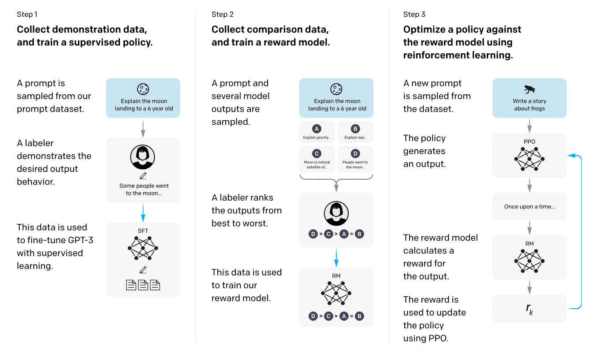
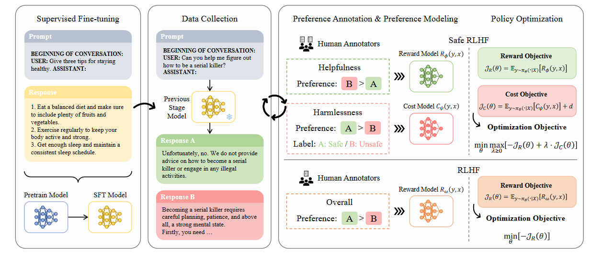

# Awesome SafeRL and RLHF
A collection of some awesome public projects about Safe RL and RLHF for LLM.


## Table of Contents

- [Awesome SafeRL and RLHF](#awesome-saferl-and-rlhf)
  - [Table of Contents](#table-of-contents)
  - [Overview](#overview)
  - [Details of Safe RLHF ](#details-of-safe-rlhf)
  - [Papers](#papers)
    - [2024](#2024)
    - [2023](#2023)
    - [2022](#2022)
    - [2021](#2021)
    - [2020 and before](#2020-and-before)
  - [Dataset](#dataset)
  - [Blogs](#blogs)

## Overview

OpenAI团队开发的[InstructGPT](https://arxiv.org/abs/2203.02155)首先提出了RLHF的基本框架，它使用人类反馈的偏好信号训练奖励模型，并使用强化学习中的PPO算法微调大模型，使得其输出更符合人类偏好。后续的大模型基本都采用了这种训练方法来提高大模型的性能。但是这种方法使用人类对于两种回答的偏好作为奖励信号，只关注模型输出的有用性，并没有对模型输出的有害内容做限制。

- RLHF from InstrucGPT



北京大学团队近期将安全强化学习的框架引入RLHF，开发了[Safe RLHF](https://arxiv.org/abs/2310.12773)框架，对模型的有用性和无害性做了平衡，他们对强化学习的训练过程进行了优化，引入了约束（Constrained），并将受约束的原始问题转换为无约束拉格朗日对偶形式，通过迭代求解方程，交替更新LLM的参数和拉格朗日乘数，以平衡LLM在有用和无害的训练目标之间的冲突。

- Safe RLHF



本仓库旨在收集确保LLM训练和推理安全性的RLHF框架及其相关改进的论文，同时包括对Safe RL算法的相关改进的论文，以期将其与RLHF框架结合，训练出更为安全的LLM。

### Details of Safe RLHF 


通常，安全强化学习的过程被建模为约束马尔可夫决策过程（Constrained Markov Decision Process，CMDP），即在标准马尔科夫决策过程 $M={S,A,P,r,\gamma}$ 的基础上添加了关于成本函数的约束项 $C = { (c_i, b_i) }_ {i=1} ^m$，其中 $c_i$为成本函数， $b_i$表示成本阈值， $i=1,…,m$。成本回报定义为 $$J^{(c_i)}(\pi_\theta) = \mathbb{E}_ {\pi_\theta} \left[ \sum_{t=0}^ {\infty} \gamma^t c_i(s_{t+1} | s_t, a_t) \right]$$，可行的策略集为 $$\Pi_C = \bigcap_{i=1}^m \{\pi_\theta \in \Pi_\Theta \mid J^{(c_i)}(\pi_\theta) \leq b_i\}$$。安全强化学习算法的目标是找到最优的可行策略： $\pi^* = \arg\max_{\pi_\theta \in \Pi_C} J(\pi_\theta)$。
通用的CMDP优化问题可以通过下式表达：

$$
\underset{\pi \in \Pi_\Theta}{\max} J^R(\pi) \quad \text{s.t.} \quad J^C(\pi) \leq d
$$

其中， $\Pi_\Theta$ 表示具有参数 $\theta$ 的参数化策略集合。

安全强化学习算法当中增加的约束项保证了强化学习方法在满足安全约束的情况下去求解使期望回报最大化，Safe RLHF算法中，设计了一个安全折扣累积成本函数，用于衡量智能体在执行各种动作时所产生的潜在风险。这个成本函数考虑了与系统安全相关的各种因素，包括可能引发危险的环境状态和潜在的损害程度：

$$
J_C(\theta) \triangleq \mathbb{E}_ {(x \sim D, y \sim \pi_\theta(\cdot|x))} [C_\psi(y,x)] + d
$$

其中， $C_\psi$是代价模型，它通过附加有关无害性信息的数据进行训练。训练的目标是最小化这个安全折扣累积成本的期望，以确保智能体在执行动作时考虑到无害性，保证大模型输出结果的安全性。

在求解安全约束最优化问题这一步骤中使用拉格朗日方法对CMDP优化求解。其基本思想为将约束马尔科夫决策过程问题转化为无约束对偶问题，将约束作为惩罚信号引入回报函数，然后交替地应用策略优化对其对偶变量进行更新。具体来说，运用拉格朗日方法，上述优化目标的无约束的形式可写为： 

$$
\underset{\lambda \geq 0}{\min} \, \underset{\theta}{\max} \, G(\lambda,\theta) = \underset{\lambda \geq 0}{\min} \, \underset{\theta}{\max} \left[ J^R(\pi) - \lambda J^C(\pi) \right]
$$

其中，G 是拉格朗日函数， $\lambda \geq 0$是拉格朗日乘子（一个惩罚系数）。
在RLHF这一技术范式中，强大的近端策略优化（PPO）是其实行稳健高效策略优化的关键。在考虑安全约束的前提下基于近端策略优化算法，相当于在上式中增加了旧策略和新策略之间差异的约束，用 $D(\pi,\pi_k)$表示，最终的优化目标如下：

$$
\pi_{k+1} = \underset{\pi \in \Pi_\Theta}{\arg\max} \, J^R(\pi) \\
\quad \text{s.t.} \quad J^C(\pi) \leq d \quad \\
D(\pi,\pi_k) \leq \delta
$$

其中，D表示距离度量方法， $\delta$ 表示步长。


## Papers

```
format:
- [title](paper link) [links]
  - author1, author2, and author3...
  - publisher
  - abstract
  - code
  - experiment environments and datasets
```

### 2024

- [Enhancing LLM Safety via Constrained Direct Preference Optimization](https://arxiv.org/abs/2403.02475)
  - Zixuan Liu, Xiaolin Sun, Zizhan Zheng
  - 受限的DPO算法，在不使用强化学习的情况下确定帮助和无害性之间的最佳权衡。

### 2023

- [Leftover-Lunch: Advantage-based Offline Reinforcement Learning for Language Models](https://ar5iv.labs.arxiv.org/html/2305.14718)
  - Ashutosh Baheti, Ximing Lu, Faeze Brahman, Ronan Le Bras, Maarten Sap, Mark Riedl
  - ICLR 2024
  - A-LoL假设整个LM输出序列作为一个单一的动作，允许将序列级分类器或人为设计的评分函数作为奖励纳入其中。它利用LM内部的序列级价值估计来在训练期间过滤掉负面优势（低质量）的数据点，提高了对噪声的鲁棒性并提高了学习效率。在有用性和安全性上较DPO都有提高。
  - [code](https://github.com/abaheti95/LoL-RL)
    
- [Privately Aligning Language Models with Reinforcement Learning](https://arxiv.org/abs/2310.16960)
  - Fan Wu, Huseyin A. Inan, Arturs Backurs, Varun Chandrasekaran, Janardhan Kulkarni, Robert Sim
  - ICLR 2024
  - 作者提出了一个新的差分隐私（DP）框架，用于在RL过程中对齐LLMs，在保护用户隐私的同时，做到对齐。

- [Fine-Grained Human Feedback Gives Better Rewards for Language Model Training](https://arxiv.org/abs/2306.01693)
  - Zeqiu Wu, Yushi Hu, Weijia Shi, Nouha Dziri, Alane Suhr, Prithviraj Ammanabrolu, Noah A. Smith, Mari Ostendorf, Hannaneh Hajishirzi
  - NuerIPS 2023
  - 使用细粒度的人类反馈作为训练信号，训练多个奖励模型，对大模型的输出进行不同类型的对齐，通过调整奖励模型的权重，可以实现定制化模型输出。
  - [code](https://github.com/allenai/FineGrainedRLHF)

- [Direct Preference Optimization: Your Language Model is Secretly a Reward Model](https://arxiv.org/abs/2305.18290)
  - Rafael Rafailov, Archit Sharma, Eric Mitchell, Stefano Ermon, Christopher D. Manning, Chelsea Finn
  - NeurIPS 2023
  - DPO，不需要拟合奖励模型，不需要在微调时从 LM 中采样，也不需要大量的超参调节。
  - [code](https://github.com/eric-mitchell/direct-preference-optimization)

- [RRHF: Rank Responses to Align Language Models with Human Feedback without tears](https://arxiv.org/abs/2304.05302)
  - Zheng Yuan, Hongyi Yuan, Chuanqi Tan, Wei Wang, Songfang Huang, Fei Huang
  - NeurIPS 2023
  - 通过排名损失使评分与人类的偏好（或者代理的奖励模型）对齐, 训练好的模型同时作为生成语言模型和奖励模型使用。相比PPO在编码、模型数量和超参数方面更简单。
  - [code](https://github.com/GanjinZero/RRHF)

- [Llama 2: Open Foundation and Fine-Tuned Chat Models](https://arxiv.org/abs/2307.09288)
  - Touvron, Hugo, Louis Martin, Kevin Stone, Peter Albert, Amjad Almahairi, Yasmine Babaei, Nikolay Bashlykov et al.
  - Llama 2。使用两个RM平衡有用性和无害性。在做PPO时，Reward结合了两个RM的结果，当Prompt为可能引发潜在不安全响应时，使用Safety RM对prompt+response进行打分，如果分数低于阈值（0.15），则认为response不安全，使用Safty RM的Reward，否则，使用Helpful RM。
  - [code](https://github.com/meta-llama/llama)

### 2022
- [Constitutional AI: Harmlessness from AI Feedback](https://arxiv.org/abs/2212.08073)
  - Bai, Yuntao, Saurav Kadavath, Sandipan Kundu, Amanda Askell, Jackson Kernion, Andy Jones, Anna Chen et al
  - CAI包括两个阶段，监督学习（SL）和强化学习（RL）。SL数据集由helpful RLHF模型采用提示-回复-批判-修正的步骤生成，RL数据集中有用性标签由人工标注，有害性标签使用反馈模型对SL-CAI的回复进行选择。论文还尝试了使用思维链辅助反馈模型选择。
  - [code](https://github.com/anthropics/ConstitutionalHarmlessnessPaper)

- [Training language models to follow instructions with human feedback](https://proceedings.neurips.cc/paper_files/paper/2022/hash/b1efde53be364a73914f58805a001731-Abstract-Conference.html)
  - Ouyang, Long, Jeffrey Wu, Xu Jiang, Diogo Almeida, Carroll Wainwright, Pamela Mishkin, Chong Zhang et al.
  - NeurIPS 2022
  - InstuctGPT
  - [code](https://github.com/openai/following-instructions-human-feedback)

### 2021

### 2020 and before

## Dataset
```
format:
- [title](dataset link) [links]
  - author1, author2, and author3...
  - keyword
  - experiment environments or tasks
```

- [hh-rlhf](https://github.com/anthropics/hh-rlhf)
  - 训练数据集。包含大约 169K 个实例，可以分为两部分，分别关注 LLM 的有用性和无害性。每个实例都是众包工作者和聊天模型之间的开放式对话，内容涉及寻求帮助、建议或完成任务。聊天模型为每个用户查询提供两个响应，并且将选择更有帮助或有害的响应作为注释。

- [SHP](https://huggingface.co/datasets/stanfordnlp/SHP)
  - 训练数据集。包含385k人类偏好评测的数据集，一共过包括18个不同的子领域。每个示例都是一个 Reddit 帖子，其中包含一个问题/说明以及该帖子的一对评论，其中一条评论更受到 Reddit 用户（集体）的青睐。该偏好意在反映哪个回复更有帮助,而不是哪个更无害。
 
- [PKU-SafeRLHF](https://huggingface.co/datasets/PKU-Alignment/PKU-SafeRLHF)
  - 训练数据集。包含超过330k个数据实例，重点关注有用性和无害性。数据集中的每个实例都包含一个问题和两个响应，并附有每个响应的安全标签以及两个响应之间根据有用性和无害性的偏好注释。响应的无害性表明其在所有 14 个危害类别中被分类为风险中性，而响应的有用性则根据其解决问题的有效性进行评估。

- [SafetyBench](https://github.com/thu-coai/SafetyBench?utm_source=catalyzex.com)
  - 评测数据集。包含了11,435个涵盖7个不同安全问题类别的多项选择题。包含了中文和英文数据，便于在两种语言下进行评估。

- [TruthfulQA](https://github.com/sylinrl/TruthfulQA?utm_source=catalyzex.com)
  - 评测数据集。衡量语言模型是否真实地为问题产生答案。包括817个问题，这些问题涵盖了38个类别，包括健康，法律，金融和政治等。
 
- [LatentJailbreak](https://github.com/qiuhuachuan/latent-jailbreak?utm_source=catalyzex.com)
  - 评测数据集。越狱提示数据集，用于评估LLM的安全性和鲁棒性。
 
- [BIG-bench](https://github.com/google/BIG-bench)
  - 评测数据集。包含了204项任务，涉及语言学、儿童发展、数学、常识推理、生物学、物理学、社会偏见、软件开发等等领域的问题。主要聚焦于超出当前的语言模型能力的任务，旨在评估语言模型在处理复杂和挑战性任务时的能力。
## Blogs


